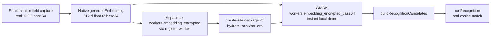

# Pehchaan — Forward Plan of Action

**NHAI Hackathon 7.0 · Submission deadline: 05 June 2026**  
**Audience:** Aahil, Maulik, Anoushka, Sanyam  
**Last updated:** 04 June 2026 (post Day 2 merge + ML bridge glue)

This document is the single source of truth for what is **done**, what is **stubbed**, and what each person must ship to reach a **real, demoable Tier 0** on **Android and iOS**.

---

## 1. Executive summary

We have strong scaffolding: auth UI, camera capture, native TFLite bridge on Android, WatermelonDB, site-package v2 crypto, Supabase schema + RLS, and Hindi/English i18n.

**The product still behaves like a demo** because one pipeline is missing end-to-end:

> **No real face embeddings are ever created, stored, or matched.**

Enrollment and field registration save placeholder strings instead of photos. The native bridge has no `generateEmbedding` method. `register-worker` does not write `workers.embedding_encrypted`. So `buildRecognitionCandidates()` returns empty embeddings and `runRecognition` **always falls back to the JS stub** — even on a device with the ML bridge and `.tflite` models installed.

**Today’s goal (confirmed by team):**

1. Build the **full embedding pipeline** (capture → embed on-device → WMDB + Supabase → site package → real cosine recognition).
2. Close **all Tier 0** items from [Pehchaan_Implementation_Plan_v2.md](../Pehchaan_Implementation_Plan_v2.md) on **both platforms**.
3. **iOS native work is owned by Maulik** (Mac + Xcode).

**Integration checkpoints today**

| Time | Checkpoint | Owner(s) | Pass criteria |
|------|------------|----------|---------------|
| AM | `generateEmbedding` on Android | Sanyam | Returns 512-d base64 from a real camera frame in Logcat/JS |
| Midday | One worker enrolled with real embed | Maulik + Anoushka | WMDB row has `embedding_encrypted_base64`; Supabase `workers` row updated |
| Midday | Recognition non-stub | Aahil + Sanyam | `runRecognition` returns matched `workerId` for enrolled face |
| Afternoon | Liveness passes when user blinks/turns | Sanyam + Aahil | 3/3 manual attempts on device |
| Afternoon | Sync purge-after-ACK | Anoushka | Local attendance row purged after server ACK |
| EOD | iOS bridge live | Maulik | `NativeModules.FaceRecognition` defined; quality/recognition run on iOS device |
| EOD | Benchmarks measured | Sanyam + Anoushka | Section 9 table in implementation plan filled from hardware |

---

## 2. Where we stand (code audit)

Status as of merge to `main` after Sanyam’s ML branch + project-level camera/bridge wiring.

### 2.1 Tier 0 checklist

| Item | Status | Notes |
|------|--------|-------|
| Face recognition (TFLite, Indian-tuned) | **PARTIAL** | Android bridge done; recognition stubbed without embeddings |
| Offline liveness (blink + head-turn) | **PARTIAL** | Wired to native; **fails often when user blinks** (see §7) |
| Employee registration (central + field) | **PARTIAL** | UI + WMDB queue done; **no real capture/embed** |
| Multilingual (en + hi) | **DONE** | 122 keys mirrored; toggle on auth Settings only |
| Integration layer + OpenAPI | **PARTIAL** | Interfaces exist; paths drift vs `openapi.yaml`; mostly no-op |
| RN ↔ TFLite bridge | **PARTIAL** | Android registered; **iOS not in Xcode target** |
| Site package download/decrypt/hydrate | **PARTIAL** | v1/v2 pipeline works; needs `SITE_PACKAGE_MASTER_KEY` + embeddings in package |
| Supervisor visual confirmation | **DONE** | Confirm writes WMDB; integration push optional |
| Offline attendance queue + sync | **PARTIAL** | Upload + backoff + **server `verified` + local `purged` tombstone** (N3 RPC + mirror); integration/DataLink still stubbed |
| Benchmarks (measured) | **MISSING** | Desktop ML metrics exist; device table empty |

### 2.2 What actually works today

| Area | Works | Does not work yet |
|------|-------|-------------------|
| **Auth flow** | Camera capture → native quality/liveness/recognition *when* bridge + frames + candidates exist | Recognition → stub without embeddings in WMDB |
| **Android ML** | `FaceRecognitionModule.kt`: `checkFaceQuality`, `runInference`, `checkLiveness` | No `generateEmbedding`; `.tflite` gitignored (manual copy to `android/app/src/main/assets/`) |
| **iOS ML** | Swift source files exist | Not compiled; no models in bundle; module name mismatch → always stub |
| **Site package** | Download, v2 AES-GCM decrypt, unpack, hydrate workers | v1 packages have no embeddings; hydration skipped without master key |
| **Sync** | `pending` → `uploading` → RPC insert → server **`verified`** + `synced_at`; mirror → **`purged`** + `purged_at` (env defers purge until integration); exponential backoff | Revocation / full integration pipeline still thin vs prod |
| **i18n** | en/hi complete, persisted language | No Settings on supervisor/enrollment stacks |
| **Supervisor** | Confirm/Reject → local attendance queue | Supabase sync only mounted for `device` role session |

### 2.3 Doc vs code drift (fix today)

| Topic | Old docs say | Code actually uses |
|-------|--------------|-------------------|
| Embedding size | 128-d | **512-d** MobileFaceNet |
| Match thresholds | 0.92 / 0.80 | **0.30 / 0.20 / 0.18** (`src/constants/auth.ts`, `ml/THRESHOLD_RESULTS.md`) |

Sanyam owns reconciling `CLAUDE.md`, `Pehchaan_Implementation_Plan_v2.md`, and `src/types.ts` comments.

---

## 3. Critical path — embedding pipeline

Everything else (real auth, adaptive tiers, supervisor confirm with confidence, benchmarks) depends on this.



### 3.1 Keystone (blocks everyone)

**Sanyam:** add `generateEmbedding(frameBase64)` to Android + iOS native modules.

- Pipeline: BlazeFace detect → crop/align → MobileFaceNet → L2-normalize → 512 × float32 LE → base64.
- Return: `{ embeddingBase64, qualityScore, faceFound }`.
- JS facade: `src/services/faceRecognition/index.ts` exports `generateEmbedding()` with stub fallback when bridge unavailable.

### 3.2 Parallel work once keystone exists

| Step | Owner | Files (primary) |
|------|-------|-----------------|
| Real capture in enrollment | Maulik | `src/screens/enrollment/MultiAngleCaptureScreen.tsx`, `ReferenceThumbnailScreen.tsx`, `EnrollmentReviewScreen.tsx` |
| Real capture in field registration | Aahil | `src/screens/registration/FieldCaptureScreen.tsx`, `queueFieldRegistration.ts` |
| Persist embedding server-side | Anoushka | `supabase/functions/register-worker`, `src/services/registration/registerWorker.ts` |
| Local worker row for same-device demo | Anoushka + Maulik | `hydrateLocalWorkers.ts` or direct WMDB write after enroll |
| Pass embedding in site package | Anoushka | `supabase/functions/create-site-package`, `sitePackageManifest.ts` |
| Recognition uses candidates | Aahil | Already wired in `RecognitionScreen.tsx` + `candidates.ts` |

**Acceptance (embedding pipeline done):**

1. Enroll one worker with a **real frontal photo** and non-empty `embedding_encrypted_base64` in WMDB.
2. Run worker auth on the same device → `RecognitionScreen` returns that worker’s ID with confidence > minimum threshold (not stub UUID).
3. After sync + site package refresh, a **second device** with hydrated package recognizes the same worker.

---

## 4. Work breakdown by owner

### 4.1 Sanyam — ML / native (keystone)

| # | Task | Acceptance criteria |
|---|------|---------------------|
| S1 | **`generateEmbedding`** in `FaceRecognitionModule.kt` + Swift | One frontal JPEG → 2048-byte float32 payload as base64; `faceFound: true` when face detected |
| S2 | **JS export** in `src/services/faceRecognition/index.ts` | Enrollment/registration screens can call it; logs bridge vs stub in `__DEV__` |
| S3 | **Liveness reliability** (with Aahil) | Retune `BLINK_EAR_THRESH` / consecutive frames; fix double-decode in `checkLiveness`; coordinate burst timing with UI |
| S4 | **Model assets reproducible** | Document/copy step: `ml/models/*.tflite` → `android/app/src/main/assets/` (+ iOS bundle via Maulik); combined ≤ 20 MB |
| S5 | **Device benchmarks** | Fill `ml/PROGRESS_SANYAM.md` + Implementation Plan §9 from physical Android (P50/P95, RAM, battery) |
| S6 | **Doc drift** | 512-d and 0.30/0.20/0.18 thresholds in team docs |

**Key files:** `android/app/src/main/java/com/pehchaanrnscaffold/FaceRecognitionModule.kt`, `ios/PehchaanRNScaffold/FaceRecognitionModule.swift`, `src/services/faceRecognition/index.ts`, `ml/PROGRESS_SANYAM.md`

---

### 4.2 Aahil — Worker auth, field registration, liveness UX

| # | Task | Acceptance criteria |
|---|------|---------------------|
| A1 | **Field registration real capture** | `FieldCaptureScreen` uses `captureFrameBase64`; stores real thumbnail + embedding from `generateEmbedding` in queue payload |
| A2 | **Liveness UX timing** | Burst spans user action window (e.g. longer burst or capture during countdown); pair with Sanyam S3 |
| A3 | **Worker auth on supervisor device** | `SupervisorHome` (or equivalent) starts auth stack so demo = enroll → auth on one tablet |
| A4 | **Hindi + layout** | Final copy pass on auth/registration; verify on Samsung A-series |
| A5 | **Demo workers** | Seed profiles with Hindi names for presentation (after real embed path works) |

**Depends on:** S1 (generateEmbedding), Anoushka A2 for server persistence of field registrations.

**Key files:** `src/screens/registration/FieldCaptureScreen.tsx`, `src/screens/auth/LivenessChallengeScreen.tsx`, `src/lib/captureFrame.ts`, `src/screens/supervisor/SupervisorHomeScreen.tsx`

---

### 4.3 Maulik — Enrollment, supervisor, integration, iOS, deck

| # | Task | Acceptance criteria |
|---|------|---------------------|
| M1 | **iOS bridge in Xcode** | `FaceRecognitionModule.swift` + `.m` in `project.pbxproj`; `RCT_EXPORT_MODULE(FaceRecognition)`; `.tflite` in Copy Bundle Resources; `pod install`; `NativeModules.FaceRecognition` non-null on device |
| M2 | **Enrollment real capture + embed** | All required angles store real base64; frontal → `generateEmbedding` → `registerWorker()` sends embedding + thumbnail |
| M3 | **Supervisor polish** | Confirmation screen production-ready; language toggle reachable from supervisor stack |
| M4 | **Integration alignment** | `src/services/integration/index.ts` paths match `openapi.yaml`; DataLink stub documented in README |
| M5 | **Presentation deck** | Architecture (offline SDK → pluggable sync → DataLink), measured benchmarks, demo script, roadmap |

**Depends on:** S1 (generateEmbedding), Anoushka N1 (register-worker accepts embedding).

**Key files:** `ios/PehchaanRNScaffold.xcodeproj/project.pbxproj`, `src/screens/enrollment/*`, `src/screens/supervisor/SupervisorConfirmationScreen.tsx`, `openapi.yaml`, `src/services/integration/index.ts`

---

### 4.4 Anoushka — Backend, sync, DB

| # | Task | Acceptance criteria |
|---|------|---------------------|
| N1 | **`register-worker` stores embeddings** | POST body includes embedding (512-d float32 base64); persisted to `workers.embedding_encrypted`; site package rebuild includes worker |
| N2 | **Registration outbox uploads captures** | `registrationOutboxSync.ts` sends `captured_angles_json` (or dedicated storage URLs if size requires) |
| N3 | **Sync state machine complete** | After server ACK: `sync_status` → `verified` → local purge → `purged` + `purged_at` set; failed rows retry with backoff |
| N4 | **`sync-revocations` edge function** | Device pulls revocations since `last_sync_at`; revoked embeddings removed from WMDB |
| N5 | **Device metadata** | Update `devices.last_sync_at` on successful sync; `trust_score` write path (minimal viable for Tier 0) — **`sync-revocations`** patches row when `device_id` sent; app passes Tier‑0 score + `app_version` from `src/constants/appInfo.ts` |
| N6 | **Benchmark harness + README** | **`npm run benchmark:auth`** (`scripts/benchmark-auth-stages.mjs`): 50 cycles → P50/P95 per stage; **[docs/BENCHMARK_AUTH.md](docs/BENCHMARK_AUTH.md)** + root **README** cover `.env`, models, Supabase, run commands |

**Depends on:** S1 for embedding bytes format agreement (512-d float32 LE base64).

**Key files:** `supabase/functions/register-worker/`, `src/services/sync/attendanceOutboxSync.ts`, `src/services/sync/registrationOutboxSync.ts`, `supabase/functions/sync-revocations/`, `src/services/sync/revocationRemoteSync.ts`, `README.md`

---

## 5. End-to-end demo script (target narrative &lt; 4 min)

Use this order for rehearsal and judging:

1. **Language** — Switch English ↔ Hindi in Settings; show liveness prompt in Hindi.
2. **Enroll worker (Maulik flow)** — Central/enrollment: details → multi-angle capture (real photos) → embedding generated → submit → worker in WMDB/Supabase.
3. **Authenticate worker (Aahil flow)** — Quality check → recognition (real match, show confidence) → liveness (blink or turn) → auth result.
4. **Supervisor confirm (Maulik flow)** — Thumbnail + name + ID → Confirm → attendance queued locally.
5. **Offline → online** — Airplane mode → auth + confirm still works → restore network → sync → show record on server / purged locally.
6. **Registration field path (optional)** — New worker on-site → queue → sync → appears in package after server processing.

**Presentation lead:** DataLink 3.0–compatible sync layer (Supabase = dev mock only).

---

## 6. Environment & local setup

Minimum for a real demo (not stub-only):

```bash
# .env (see .env.example)
SUPABASE_URL=...
SUPABASE_ANON_KEY=...
SITE_PACKAGE_MASTER_KEY=...   # 32-byte key, base64 — must match Edge secret
# Optional for DataLink stub demo:
# INTEGRATION_API_KEY=...
# INTEGRATION_ENDPOINT=...
```

| Requirement | Why |
|-------------|-----|
| Supabase project + migrations applied | Auth, workers, attendance, packages |
| `SITE_PACKAGE_MASTER_KEY` | v2 site package decrypt + hydration |
| `.tflite` in Android assets | Bridge loads models from `android/app/src/main/assets/` |
| Supervisor login with `site_id` in JWT metadata | `resolveActiveSiteId()` + candidates scoped to site |
| Physical device rebuild after native changes | `npx react-native run-android` / Maulik `run-ios` |

**Without** embeddings in WMDB: recognition **will** use stub — this is expected until §3 is complete.

---

## 7. Known issues (tracked)

| Issue | Symptom | Owners | Fix direction |
|-------|---------|--------|-------------|
| **Liveness false negatives** | Fails even when user blinks | Sanyam + Aahil | Widen capture window; retune brightness-proxy EAR; relax consecutive-frame rule |
| **iOS always stub** | No native module on iOS | Maulik | Xcode target + bundle models + `RCT_EXPORT_MODULE(FaceRecognition)` |
| **Recognition always stub** | Fixed demo worker UUID | All (§3) | Complete embedding pipeline |
| **`.tflite` not in git** | Fresh clone missing models | Sanyam | Document copy script; CI artifact → assets |
| **Supervisor attendance not syncing** | Confirm only on supervisor session | Anoushka | Mount outbox sync for supervisor role or document device-role sync step |
| **Integration path drift** | OpenAPI ≠ client paths | Maulik | Align `integration/index.ts` with `openapi.yaml` |
| **Placeholder captures** | `data:image/jpeg;base64,field-frontal-...` | Aahil + Maulik | Replace with `captureFrameBase64` |

---

## 8. Submission checklist (Tier 0)

From Implementation Plan §11 — owners should tick in team channel:

- [ ] APK/IPA on physical device (Android + iOS)
- [ ] Real enrollment → real recognition (not stub)
- [ ] Liveness passes in manual testing
- [ ] Supervisor confirm → attendance → sync → purge
- [ ] Hindi UI reviewed; language toggle demonstrated
- [ ] Benchmark table filled with **measured** values (no estimates)
- [ ] `openapi.yaml` + integration layer in repo
- [ ] README setup instructions
- [ ] Presentation deck (Maulik)
- [ ] Code committed; submission before **05 June 2026**

---

## 9. References

| Document | Purpose |
|----------|---------|
| [Pehchaan_Implementation_Plan_v2.md](../Pehchaan_Implementation_Plan_v2.md) | Full 4-day plan, API contract, benchmark table |
| [CLAUDE.md](../CLAUDE.md) | Architecture, ownership map, hackathon constraints |
| [docs/hackathon_doc.md](./hackathon_doc.md) | Official problem statement & scoring |
| [ml/PROGRESS_SANYAM.md](../ml/PROGRESS_SANYAM.md) | ML benchmarks & model status |
| [ml/WHAT_IS_LEFT_SANYAM.md](../ml/WHAT_IS_LEFT_SANYAM.md) | ML integration notes |
| [openapi.yaml](../openapi.yaml) | Integration API surface |

---

## 10. How to use this doc

1. **Pick your section (§4.1–4.4)** and work top-to-bottom; don’t start recognition polish until §3 keystone is merged.
2. **Post in team channel** when your checkpoint row in §1 is green.
3. **Blockers** — tag the keystone owner (Sanyam for `generateEmbedding`, Anoushka for `register-worker` schema).
4. **Do not** spend time on Tier 1 (adaptive auth polish, fraud analytics) until Tier 0 checkpoints are green.

Questions or scope changes → discuss in team channel; update this file in a single PR so everyone stays aligned.

---

*Internal team document — Pehchaan NHAI Hackathon 7.0*
